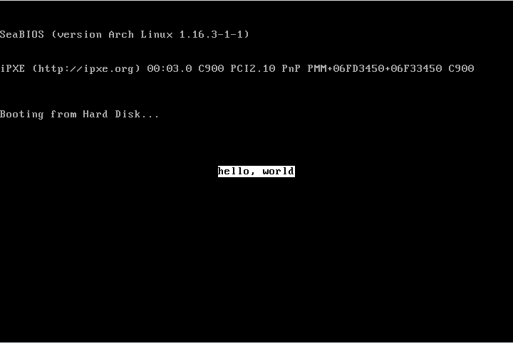
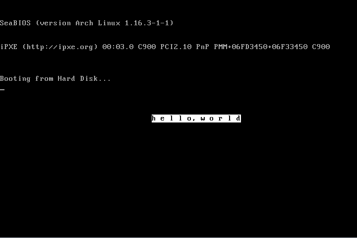
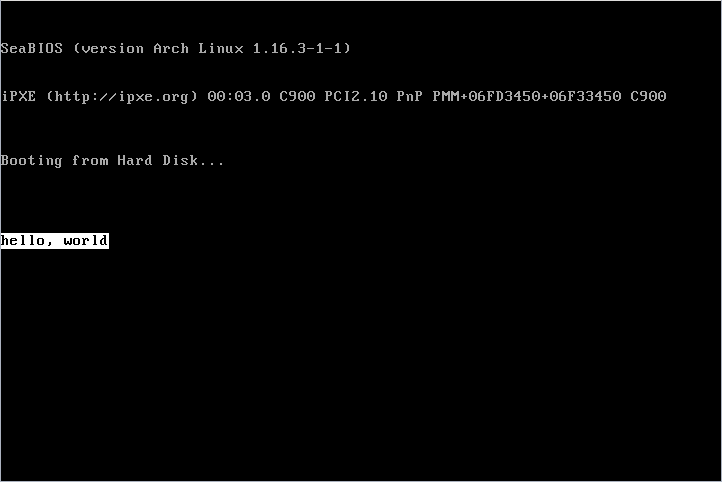
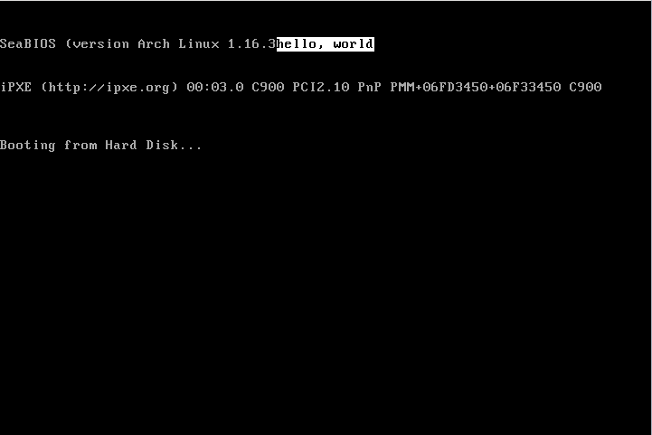
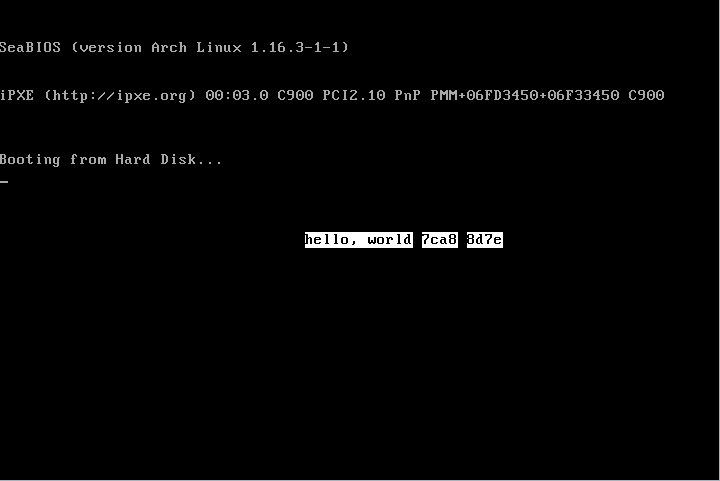
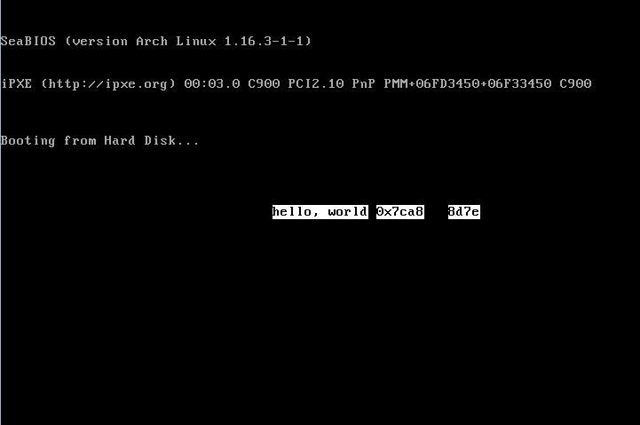
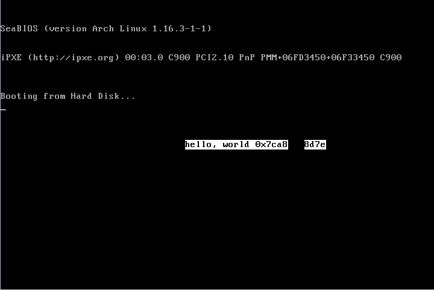
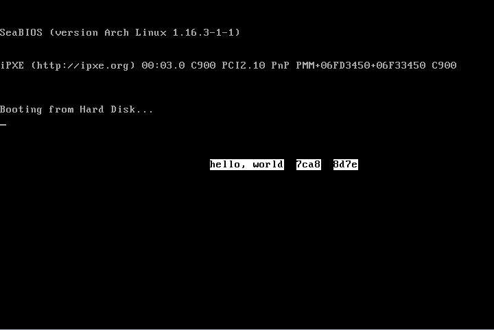

# Shell

<div align='center'>
    
</div>

## Submission

As with previous assignments, we will be using GitHub Classroom to distribute skeleton code and collect submissions. You can create your GitHub repository for this assignment at this [link](https://classroom.github.com/a/Z3M0BU9d).

You need to have at least 5 git commits total, but we encourage you to have many more. All your work should be committed to the `main` branch.

At a minimum, your `README.txt` should contain the following info:

- Your name & UNI
- Homework assignment number
- Description for each part

The description should indicate whether your solution for the part is working or
not. You may also want to include anything else you would like to communicate to
the TA grader, such as extra functionality you implemented or how you tried to
fix your non-working code.

## Additional Requirements
1. All code (including test programs) must be written in C.
2.  Follow the following coding style rules:
    - Tab size: 8 spaces.
    - Do not have more that 3 levels of indentations (unless the function is extremely simple).
    - Do not have lines that goes after the 80th column (with rare exceptions).
    - Do not comment your code to say obvious things. Use /* ... */ and not // ...
    - Follow the [Linux kernel coding style][coding-style]. Use [checkpatch][checkpatch], a script which checks coding style rules.
3.  Use a Makefile to control the compilation of your code. The Makefile should have at least a default target that builds all assigned
programs.
4.  When using `gcc` to compile your code, use the `-Wall` switch to ensure that all warnings are displayed. **Do not** be satisfied with code
that merely compiles; it should compile with no warnings. You will lose points if your code produces warnings when compiled.
5.  Check the return values of all functions utilizing system resources for all parts of the programming assignment.
6.  Your code should not have memory leaks and should handle errors gracefully.

[coding-style]: https://www.kernel.org/doc/html/v4.10/process/coding-style.html
[checkpatch]: https://github.com/torvalds/linux/blob/master/scripts/checkpatch.pl

### ARM Users
For students on ARM Mac computers (e.g. with M1/2/3/4 chip): if you want your
submission to be built/tested for ARM, you must create and submit a file called
`.armpls` in the top-level directory of your repo; feel free to use the
following one-liner:

```sh
cd "$(git rev-parse --show-toplevel)" && touch .armpls && git add -f .armpls && git commit .armpls -m "ARM pls"
```

**You should do this first so that this file is present in all parts.**


## Tips
1. For this assignment, it may be helpful to refer to [Programming in C][prog-in-c]. You might also find the [Glibc Manual][glibc-manual] useful.
2.  Many questions about functions and system behaviour can be found in the system manual pages; type in `man function` to get more
information about function. If function is a system call, `man 2 function` can ensure that you receive the correct man page, rather than
one for a system utility of the same name.
3.  If you are having trouble with basic Unix/Linux behavior, you might want to check out the resources section of the class webpage.
4.  A lot of your problems have happened to other people. Don't forget to google strange error messages first!

[prog-in-c]: https://users.cs.cf.ac.uk/Dave.Marshall/C/CE.html
[glibc-manual]: https://www.gnu.org/software/libc/manual/

## Part 1: The Simple Shell

An operating system like Linux makes it easy to run programs. For example, from a shell, it is easy to write, compile, and run a simple hello world C program:

```sh
$ vi hello.c
#include <stdio.h>
int main() { printf("hello, world!\n"); }
$ gcc hello.c -o hello
$ ./hello
hello, world
```

The operating system does this by providing various functions to enable programs to perform I/O such as printing, as well as execute other programs using the name of an executable. The shell itself is just another program. For example, the Bash shell is an executable named `bash` that is usually located in the `/bin` directory.

Try running `/bin/bash` or just `bash` on a Linux (or BSD-based, such as Mac OS X) operating system's command line, and you'll likely discover that it will successfully run just like any other program. Type `exit` to end your shell session and return to your usual shell. (If your system doesn't have Bash, try running `sh` instead.) When you log into a computer, this is essentially what happens: Bash is executed. The only special thing about logging in is that a special entry in `/etc/passwd` determines what shell runs at log in time.

Write a simple shell in C. The requirements are as follows.

1. **Your shell executable should be named shellder**. Your shell source code should mainly be in `shell.c`, but you are free to add additional source code files as long as your Makefile works, compiles and generates an executable named `shellder` in the same top level directory as the Makefile. If we cannot simply run `make` and then `./shellder`, you will be heavily penalized.

2. **The shell should run continuously, and display a prompt when waiting for input.** The prompt should be EXACTLY '$'. No spaces, no extra characters. Example with a command:

    ```sh
    $ /bin/ls -lha /home/pc/my_pokemon
    ```

3. **Your shell should read a line from stdin one at a time.** This line should be parsed out into a *command* and *all its arguments*. In other words, tokenize it.
    - You may assume that spaces are the only supported delimiter (ASCII character number 32).
    - You do not need to handle "special" characters. Do not worry about handling quotation marks, backslashes, and tab characters. This means your shell will be unable support arguments with spaces in them, such as some file paths.
    - You may set a reasonable maximum on the number of command line arguments, but your shell should handle input lines of any length. You may find `getline()` useful.

4. **After parsing and lexing the command, your shell should execute it.** A command can either be a reference to an executable OR a built-in shell command (see below). For now, just focus on running executables, and not on built-in commands.
    - Executing commands that are not shell built-ins is done by invoking `fork()` and then invoking `exec()`.
    - You may **NOT** use the `system()` function, as it just invokes the `/bin/sh` shell to do all the work.

5. **Ensure Ctrl-C works.** Typing Ctrl-C in your shell should function as expected. If a command is running, the command
should terminate, but your shell should not terminate.

6. **Implement Built-in Commands, `exit` and `cd`.** `exit` simply exits your shell after performing any necessary clean up. `cd` [dir], short for "change directory", changes the current working directory of your shell. Do not worry about implementing the command line options that the real cd command has in Bash. Just implement cd such that it takes a single command line parameter: the directory to change to. cd should be done by invoking `chdir()`.

7. **Error messages should be printed using exactly one of two string formats**. The first format is for errors where [errno][errno] is set. The second format is for when `errno` is not set, in which case you may provide any error text message you like on a single line.

    ```C
    "error: %s\n", strerror(errno)

    OR

    "error: %s\n", "your error message"
    ```

    So for example, you would likely use: `fprintf(stderr, "error: %s\n", strerror(errno));`

8. **Check the return values of all functions utilizing system resources.** Do not assume all requests for memory will succeed and all writes to a file will occur correctly. Your code should handle errors properly. Many failed function calls should not be fatal to a program.

    Typically, a system call will return -1 in the case of an error (malloc will return NULL). Check each function's man page to see how it reports errors and if it sets the errno variable. If it sets errno, you should use the first style of error message described above. You can find an overview of how functions report errors at the gnu page on [error reporting][error-reporting].

9. **A testing script skeleton is provided in a [GitHub repository][testing-repo] to help you with testing your program.** You should make sure your program works correct with this script. For grading purposes, we will conduct much more extensive testing than what is provided with the testing skeleton, so you should make sure to write additional test cases yourself to test your code.


[errno]: https://linux.die.net/man/3/errno
[error-reporting]: https://www.gnu.org/software/libc/manual/html_mono/libc.html#Error-Reporting
[testing-repo]: https://github.com/columbia-os-hw/s25-tester-hw2

## Part 2: Simple Shell Directly Calling System Calls
The simple shell you wrote in Part 1 relies on various C library functions that in turn call system calls. You can use `strace` to see what system calls are being called when you run your simple shell. First, install `strace`:
```sh
$ sudo apt install strace
```

Then you can run `strace` with your simple shell:
```sh
$ strace -o trace.txt ./shellder
```

which will dump the system calls executed into the file trace.txt. For example, if you used `printf()` to output text in simple shell, you will find that it in turn calls a system call to actually perform the I/O operation because I/O is controlled by the operating system. C library functions such as `printf()` are technically not part of the C language, but made possible by relying on functionality provided by the operating system.

If you want to trace not only the system calls executed by the shell but any processes it creates, you can add the follow-forks option:
```sh
$ strace -o trace.txt -f ./shellder
```

To gain a better understanding of how C library functions rely on operating system functionality, modify your simple shell so that it does not call any C library functions that call other system calls. Instead, your simple shell should directly call any system calls that it implicitly uses. For example, your simple shell should not call `printf()` but instead call `write()` on STDOUT. Other C library functions that you may also have to replace include `getline()`, `malloc()`, etc. You do not have to be overly concerned with efficiency, so you may find it easier to use [`mmap()`][mmap] instead of `sbrk()` for any dynamic memory allocation you need to do. For example, you may find it helpful to see this [implementation][malloc-ref] of `malloc()`. String manipulation functions such as `strtok` and `strcmp` do not call
system calls and do not need to be replaced.

[mmap]: https://man7.org/linux/man-pages/man2/munmap.2.html
[malloc-ref]: https://elixir.bootlin.com/linux/v6.13/source/tools/include/nolibc/stdlib.h#L131

Linux provides system calls which may have similar functionality. The exact system calls your simple shell uses depends the implementation choices made by the C library; you should carefully check the trace you generated to see which system calls your shell should directly call. For example, is the `fork()` system call actually used? You may find it useful in some cases to utilize the the general purpose `syscall(2)` system call. You can consult its man page for more details: `man 2 syscall`.

Note that your implementation of the various functions only has to work specifically for your simple shell. For example, you do not need to implement all functionality supported by `printf()`, only what functionality is required to print the output that your shell generates. Similarly, your input functionality only needs to work for any ascii characters generated from a keyboard.

Your shell executable should be named `shellder2`. Your shell source code should be mainly in `shell2.c`, but you are free to add additional source code files as long as your Makefile works, and compiles and generates an executable named `shellder2` in the same top level directory as the Makefile. If we cannot simply run `make` and then `./shellder2`, you will be heavily penalized. `shellder2` should have all the same functionality as `shellder`, except that it does not call any C library functions that call other system calls.

## Part 3: Bare-metal Hello World OS
Without an operating system, running a program on a computer will be harder. On an x86 computer, when the power button is pressed, the CPU is reset to its initially state and firmware, the BIOS, is executed. The BIOS checks the hardware resources of the computer, loads the first program on the storage device, for example the hard drive, into the RAM and transfers control to the program.

On an x86 computer, the BIOS reads the first sector (512B) of the hard drive, looking for the MBR (Master Boot Record). The MBR is identified by being a 512B record that ends with magic number 0x55 and 0xaa at the last two bytes. It holds the initial bootstrap code and all of the necessary information to boot the machine into the operating system. If the first sector is an MBR, the BIOS loads it into the RAM at 0x7c00 and starts executing from that position.

Usually, the bootloader is located at the MBR sector and loads the operating system, which can implement more complex functionality. But it is not necessary. A simple operating system can also be loaded directly by the BIOS. The simple operating system can be as simple as a program that prints "hello, world" to the screen. However, the program that is loaded by the BIOS does not, at least initially, have an easy-to-use C environment in which to execute.

1. **Implement a Hello World OS.** Write a simple Hello World OS that boots and prints "hello, world" to the screen. Almost all of your code should be in C, but there will be a tiny bit of assembly code programming for you to do. Because the boot procedure is architecture-dependent and more standardized on x86 computers, this portion of the assignment is x86-specific. You will use [QEMU][qemu] so that you can do the assignment using non-x86 computers too.

    We provide the starter assembly code `entry.S`. The starter code sets up a stack to switch from assembly code to C and then calls
    the main function defined in `main.c`:

    ```C
    call main
    ```

    Note that this main function is not a standard C main function for general C programs so it does not have to return an integer. The name of the function does not even have to be main, except for the fact that this is the name used in the assembly code. Note that your C code is compiled with various options indicating that it is standalone and does not rely on the standard C library or standard include files which are not available with your simple operating system.

    Modify the file main.c by writing C code to output "hello, world" to the VGA console. Because there is no separate operating system, there are no helper functions to perform I/O. However, the VGA console can be accessed just like regular memory, so you can simply perform regular memory writes to cause output to appear on screen. Specifically, the machine is initially in real mode, which means that memory is accessed directly using physical RAM locations. The framebuffer of the VGA console is mapped so it appears as physical RAM memory starting from 0xb8000. In text mode, you can print out characters by writing ascii codes starting at that position.

    You should **print out "hello, world" with white background color and black foreground color at the center of the console, all with lower case letters.** The default VGA console can print 80*25 characters. You should print "hello, world" with the specified color and position it so it is aligned to the center of the console vertically and horizontally, *with the comma after the
    first word and a space after the comma before the second word.* The console has an even number of columns, so "centered" means that the comma is immediately to the left of the center of the screen, and the space is immediately to the right. The following is an example showing the correct printing on the screen:

    <div align='center'>
        
    </div>

    In contrast, the following examples show INCORRECT printing because of incorrect placement, extra spaces, etc.:

    <div align='center'>
        
        
        
        <br>
    </div>

    The memory for each character on the VGA console is two bytes - one byte for the ascii code and the other for the color. For example, to print "hello, world" to the beginning of the VGA console, you want to write 'h' to `0xb8000`, 'e' to `0xb8002`. You can modify the second byte to change the color. The color byte can be used to control both the foreground and background color of the character, with the higher 4 bits for the background and the lower 4 bits for the foreground:

    ```
    Bit:     | 7 6 5 4 | 3 2 1 0 |
    Content: | BG      | FG      |
    ```

    and the color is defined as:

    | Color    | Value   | Color       | Value   | Color       | Value   | Color         | Value   |
    | -------- | ------- | --------    | ------- | --------    | ------- | --------      | ------- |
    | Black    | 0       | Red         | 4       | Dark grey   | 8       | Light red     | 12      |
    | Blue     | 1       | Magenta     | 5       | Light blue  | 9       | Light magenta | 13      |
    | Green    | 2       | Brown       | 6       | Light green | 10      | Light brown   | 14      |
    | Cyan     | 3       | Light grey  | 7       | Light cyan  | 11      | White         | 15      |

    However, there are some limitations due the fact that the machine will initially boot in 16-bit real mode, so your code should run in 16-bit mode. This means you will not able to directly access the framebuffer because the starting address for the framebuffer is beyond the addressing limit (ie 0xb8000 > 0xffff). Instead, you will need to use [segmentation on x86][x86-segmentation], in which

    ```
    physical address = (segment base * 0x10) + segment offset
    ```

    We have included the lines of assembly code in `main.c` that are required to set the segment base, but the lines current set the segment base to 0:

    ```assembly
    __asm__("mov $0x0, %ax");
    __asm__("mov %ax, %ds");
    ```

    You need to modify this code to set the segment base so that you can access the framebuffer. If the segment base is set correctly, the segment offset (aka an address in subsequent C code) will function as an offset into the framebuffer. Use this to write characters to the VGA console by treating the desired offsets in the framebuffer as addresses.

    Note that all of your code in `main.c` along with the code in `entry.S` must build and fit in the 512B available for the MBR. You should not use any global variables in your C code. Keep code size minimal: gcc's `-Os` should be helpful when compiling. Use the `volatile` keyword to avoid unexpected compiler optimizations for any variables referenced in assembly, as well as for index variables in for loops.
    
    Once you have finished writing characters to the framebuffer, you need to prevent the machine from going off into undefined behavior. In particular, the assembly code in `entry.S` does nothing further once the main function returns. Since there are no further instructions specified, the system will crash if you reach this state. Ensure that your hello world OS does not let the machine run into this undefined state. A loop of some kind here would be useful.

[qemu]: https://qemu.org/
[x86-segmentation]: https://en.wikipedia.org/wiki/X86_memory_segmentation

2. **Create a floppy disk image that holds the Hello World OS.** To start the computer from power on without requiring a bootloader, you need to use a storage device to hold your Hello World OS such that its first sector is an MBR. For this purpose, you can create a floppy disk image such that the last two bytes of the first sector contain the required magic number `0x55` and `0xaa`. To do this, you will compile your `main.c` and link it with an assembled `entry.S` to create the disk image, ensuring that the magic number required is placed in the 511th and 512th bytes of the image. We have provided a linker script that does most ofthe hard work.

    **x86 VM:** If you are using an x86 VM, the commands you need to execute are:
    ```sh
    $ as --32 -Os -o entry.o entry.S
    $ gcc -c -m16 -ffreestanding -fno-PIE -nostartfiles -nostdlib -Os -o main.o -std=c99 main.c
    $ ld -m elf_i386 -o main.elf -T linker.ld entry.o main.o
    $ objcopy -O binary main.elf floppy.flp
    ```
    which will create the floppy image `floppy.flp`, padded with zero bytes at the end beyond the 512th byte.

    **Arm VM:** If you are using an Arm VM, you will first need to install the cross-compile toolchain in your VM:
    ```sh
    $ sudo apt install crossbuild-essential-amd64
    ```

    Then the commands you need to execute are:
    ```sh
    $ x86_64-linux-gnu-as --32 -Os -o entry.o entry.S
    $ x86_64-linux-gnu-gcc -c -m16 -ffreestanding -fno-PIE -nostartfiles -nostdlib -Os -o main.o -std=c99 main.c
    $ x86_64-linux-gnu-ld -m elf_i386 -o main.elf -T linker.ld entry.o main.o
    $ x86_64-linux-gnu-objcopy -O binary main.elf floppy.flp  
    ```
    which will cross-compile the x86 code in your Arm VM and create the floppy image floppy.flp, padded with zero bytes at the end beyond the 512th byte.

3. **Using your floppy image to boot in QEMU.** You could reboot your VM using your floppy image if you have an x86 VM, but this will not work for an Arm VM because your Hello World OS is x86-specific. To provide a consistent approach for both x86 and Arm VM users, you will instead use QEMU to create a virtual x86 computer inside your VM to use to boot your Hello World OS. QEMU is a machine emulator that you can use to run x86 code on Arm hardware and it can also run x86 code on x86 hardware. First install QEMU in your VM:
    ```sh
    $ sudo apt install qemu-utils qemu-system-x86 qemu-system-gui
    ```

    Then you can use the floppy image to boot an x86 machine using QEMU:
    ```sh
    $ sudo qemu-system-x86_64 -drive file=floppy.flp,format=raw -vga std
    ```

    Note that the options for this QEMU command require access to the graphical user interface of the VM and so will not work over SSH. You must first install the `qemu-system-gui` package before launching QEMU and you should not use QEMU with `-nographic` option. Other than the cross-compilation, the other instructions are the same for both x86 hardware users and Arm hardware users. You should be able to boot using QEMU with the Hello World OS you built and see "hello, world" printed on your console.

4. **Add instruction and stack pointer information to your output.** A CPU uses a program counter (also known as instruction pointer) and stack to run C programs. The instruction pointer (IP) refers to the location in memory from which to get the CPU instruction to execute. The stack pointer (SP) refers to the location in memory where the stack is located for the program, which is required for any programs that make function calls. When making a function call, the IP is saved on the stack so that when the function call is done, the IP can be popped off the stack to return program execution to right after where the function call was originally initiated. The IP and SP are stored in special CPU registers. You should retrieve those values as part of your Hello World OS and output them along with the "hello, world" message.

    The exact format of your message should be "hello, world ip sp", which one space before the actual ip and sp values, respectively and the space should be black background. Do not add additional spaces and make sure you use the correct background and foreground color. The ip should be the actual instruction pointer address right after the code used to output "hello, world". The sp should be the actual stack pointer address after calling the main function in main.c from entry.S. Each address should be printed as a 4 digit lower case hexadecimal number; only 4 digits are required because you are running in 16-bit real mode. Do NOT print anything other than the 4 digits for each value (ie. no leading 0x). To output the addresses as characters, you need to convert them to ascii characters and then write them to VGA memory. Note that the position of "hello, world" should be exactly the same as before without the ip and sp values. The following is an example showing the correct printing on the screen with ip and sp values of 7ca8 and 8d7e, respectively:

    <div align='center'>
        
    </div>

    In contrast, the following examples show INCORRECT printing because of incorrect background color, extra spaces, etc.:

    <div align='center'>
        
        
        
    </div>

    To read the IP and SP registers, you need to use assembly code. You may NOT hardcode the value displayed for either of these registers. The SP register can be read directly using the `mov` instruction. We have included the lines of assembly code in `main.c` that are required to get the address needed:

    ```assembly
    __asm__ volatile (
            "mov %%sp, %0"
            : "=r" (sp_value)
            :
            : "memory"
    );
    ```

    You need to modify the code to define a local variable `sp_value` so that you can get the stack pointer value after calling this inline assembly code.

    Reading the IP register is more complicated as there is no way to directly read the IP register. Instead, we have provided some assembly code defined in `entry.S` to the get the IP value:
    ```assembly
    .global get_ip

    ...

    get_ip:
        pop %ax
        push %ax
        ret
    ```

    `get_ip()` is declared as a function in `main.c`. It uses the fact that on a function call, the top of the call stack stores the function's return address: the address of the next instruction to execute after the function returns. It also uses the fact that an x86 function call uses register `ax` to store the return value. To get the IP value, call `get_ip()` right after the code used to output "hello, world" in `main.c`. Calling `get_ip()` will store the address of next instruction after the call to `get_ip()` at the top of stack. Note that because `get_ip()` returns the address of the instruction after `get_ip()`; you will need to do additional work to get the correct address, which is the address of the instruction right after the code used to output "hello, world".

    Once you have completed your program, you will need to redo steps 2 and 3 above to recompile the code to generate a new `floppy.flp` image and boot it in QEMU.

    As part of your submission, you should ensure that a Makefile is included under the part3 directory to compile your code and create a bootable disk image (see above for disk creation instructions, or refer to the provided Makefile). The bootable disk image must be named `floppy.flp`.
